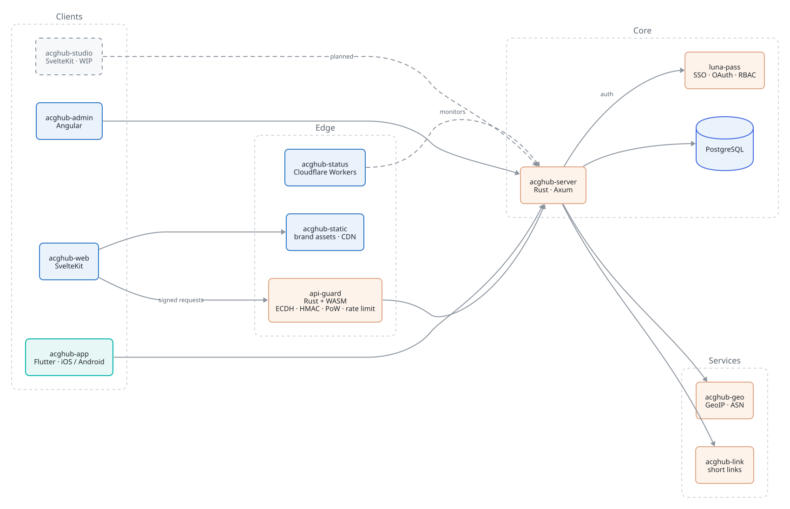
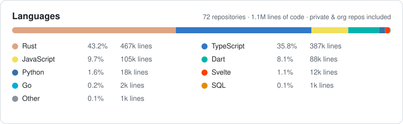

<!-- 此文件由 scripts/build_readme.py 生成 README.md，请改 README.template.md，不要直接改 README.md -->

<picture>
  <source media="(prefers-color-scheme: dark)" srcset="./assets/banner-dark.svg">
  
</picture>

  
  
  
  

  
  
  
  
  
  
  
  
  
  
  

## 👋 About

I build production software end to end: Rust backends, TypeScript / Svelte frontends, Flutter mobile clients, and the infrastructure around them. My degree is in AI application, and my day job is building LLM agents for finance and ERP workflows. On the side I run **[ACGHub](https://acghub.net)**, a community platform I have designed, written and operated alone since 2024, and I am writing **[Qingjian](https://qingjian.app)**, a pinyin input method in Rust.

Most of my code lives in private repositories, so the projects below come with their scale instead of a link. The numbers and the language chart are regenerated weekly from the repositories themselves.

## 🖥 Showcase

<table>
  <tr>
    <td width="50%" align="center">
       
      <b>ACGHub</b> · community feed, tags, weekly anime schedule
    </td>
    <td width="50%" align="center">
       
      <b>Qingjian 青简</b> · input method that teaches a word per keystroke
    </td>
  </tr>
  <tr>
    <td colspan="2" align="center">
       
      <b>ACGHub Studio</b> · script-to-storyboard workbench, two-page spread canvas with pacing strip
    </td>
  </tr>
</table>

## 🏗 ACGHub at a glance

One person, one platform, twelve repositories. Everything below is written and operated by me.

## 🚀 Selected work

| Project | Stack | Status | Scale | What it is |
|---|---|:---:|---|---|
| **ACGHub**   [acghub.net](https://acghub.net) |     |  | **{{acghub.commits}} commits**   {{acghub.lines}}   {{acghub.lines.dart}} Dart | Tag-driven community platform for anime, comics and games. Backend, web, mobile app, admin console, static CDN, status page and short-link service, all one person. |
| **ACGHub API Guard** |   |  | {{api_guard.lines}} | Browser-to-server request integrity layer: ECDH session keys, HMAC canonical requests, nonce + timestamp windows, proof-of-work handshake, multi-dimension rate limiting. Turns "one `curl` line" into "days of reverse engineering". |
| **Luna-Pass** |   |  | {{luna_pass.lines}} | Unified auth and SSO across all ACGHub subdomains: local accounts, OAuth (GitHub / Google), opaque-token sessions, RBAC with role inheritance. |
| **ACGHub Studio** |   |  | frontend MVP | Script-to-storyboard (ネーム) workbench for comic authors: prose script in, editable paged panels out. Two-page spread canvas with RTL reading order, a pacing strip that plots panel density and page-turn hooks, procedural composition sketches from shot type, camera and cast. Rust backend next. |
| **Qingjian 青简**   [repo](https://github.com/qingjian-team/qingjian) · [qingjian.app](https://qingjian.app) |  |  | {{qingjian.lines}} | Cross-platform pinyin input method that shows a translation next to each candidate in the language you are learning. Fully local: dictionary, learning state and n-gram all on device. macOS beta. |
| **Bling Atelier** |   |  | {{bling.lines}} | AI product-image generation fused with a lightweight ERP (SPU / SKU, assets, render history, inventory) for apparel sellers. |
| **Bank receipt RPA** |   |  | {{zyra.lines}} | Automated download and archival of bank receipts from multiple Chinese banks, with task queue, dashboard and object-storage upload. Built for finance operations at work. |

Lines are code only (tokei, no config / markup / vendored code). Updated {{updated_at}}.

## 📦 Open source

| Repo | What |
|---|---|
| [qingjian-team/qingjian](https://github.com/qingjian-team/qingjian) | Rust input method engine described above |
| [my-axum-starter](https://github.com/yenharvey/my-axum-starter) | Axum project template with the conventions I use in production |
| [qq-bot-rs](https://github.com/yenharvey/qq-bot-rs) | QQ bot SDK in Rust |
| [tencent-sdk-unofficial](https://github.com/yenharvey/tencent-sdk-unofficial) | Typed Rust client for Tencent Cloud APIs |
| [aliyun-dypns](https://github.com/yenharvey/aliyun-dypns) | Rust SDK for Aliyun SMS verification |
| [tieba-sign](https://github.com/yenharvey/tieba-sign) | Baidu Tieba check-in CLI |
| [mygo-studio/anon-flatten](https://github.com/mygo-studio/anon-flatten) | Directory flattening tool |
| [yahboom_gps](https://github.com/yenharvey/yahboom_gps) | Serial GPS driver for a Yahboom module |

## 🛠 Skills

- **Rust** — primary language. Axum, Tokio, SeaORM, WASM, CLI tooling, SDK design. Comfortable owning a 200k-line codebase alone.
- **AI applications** — LLM agents, tool use, multi-agent orchestration, RAG. Finance and ERP agents in production at work.
- **Web** — TypeScript, SvelteKit, Next.js, Cloudflare Workers. Flutter for mobile.
- **Python** — automation, RPA, data pipelines, FastAPI.
- **Infrastructure** — PostgreSQL, Docker, GitHub Actions, CDN and edge deployment, Tencent Cloud and Aliyun.
- **Learning** — C# and .NET.

## 🧭 Now

- Writing Qingjian, the Rust input method above. Currently macOS beta.
- Building a finance / ERP agent at work, plus the full-stack around it.
- Running and growing ACGHub; getting Studio from mock data to a Rust backend.

## ✍️ Writing

Latest from [yenharvey.com](https://yenharvey.com):

{{blog_posts}}

## 📈 Languages

Code lines by language across all {{languages.repos}} repositories I own or contribute to, private and organization repos included. Counted with tokei, config and markup excluded.

<picture>
  <source media="(prefers-color-scheme: dark)" srcset="./assets/languages-dark.svg">
  
</picture>
